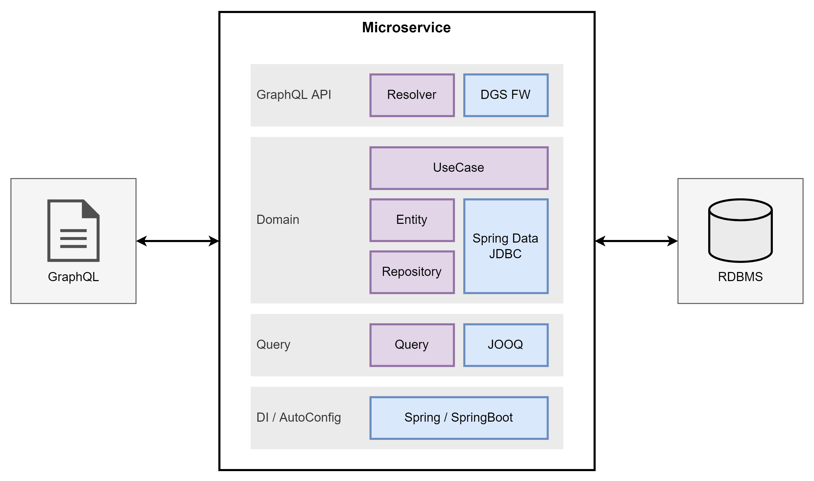

## 作るもの

GraphQLのAPIを持ち，データベースを使用するマイクロサービスを開発します。

## 使用する技術

以下の技術を使用します。

| 技術 | 説明 |
| ---- | ---- |
| Kotlin | プログラミング言語。 |
| Gradle | ビルドツール。 |
| Spring Boot | アプリケーション開発用フレームワーク。 |
| DGS Framework | GraphQLサーバー用フレームワーク。 |
| Spring Data JDBC | ORMフレームワーク。 |
| JOOQ | ORMフレームワーク。 |
| PostgreSQL | データベース。 |
| Flyway | DB Migrationツール。 |
| Kotest | 自動テストフレームワーク。 |
| Mockk/Spring Mockk | モックライブラリ。 |

## アーキテクチャ

