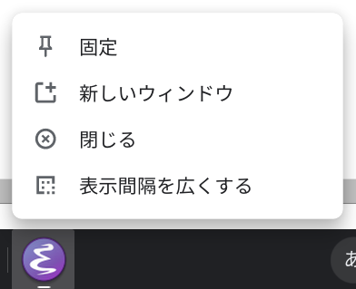
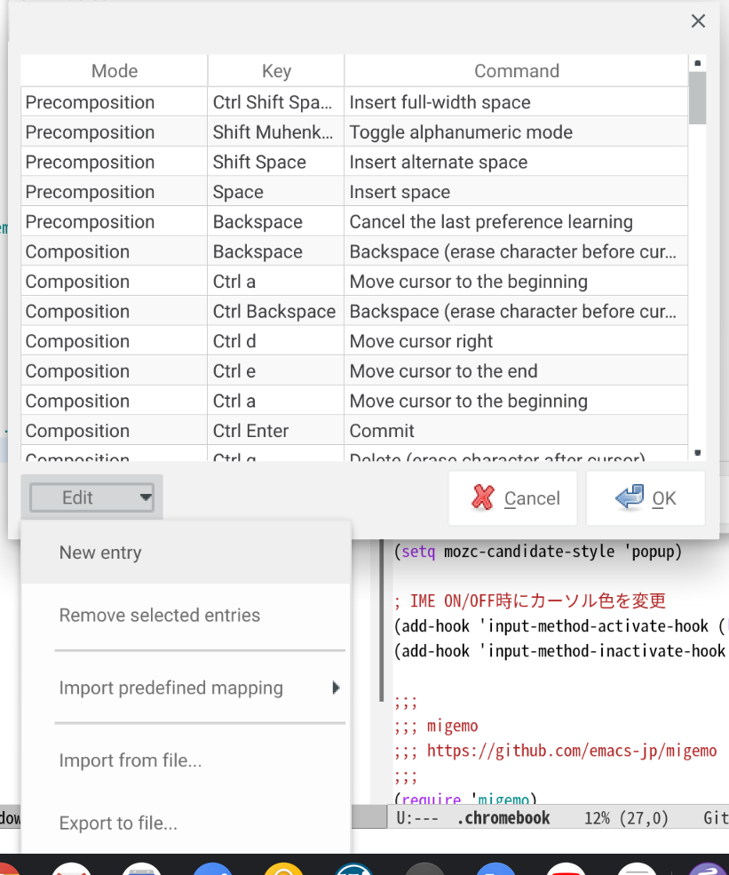

## 環境

このページの内容は Lenovo IdeaPad Duet Chromebook で動作を確認しています。

## Emacsのインストール

以下のコマンドを実行してEmacsをインストールします。

```sh
sudo apt-get update
sudo apt-get install emacs
```

## mozcなどのインストール

以下のコマンドを実行します。
mozcは日本語入力用IMEです。
emacs-mozcやemacs-mozc-binはmozcをEmacsで使用するためのパッケージです。

```sh
sudo apt-get install mozc emacs-mozc emacs-mozc-bin
```

## Emacsの設定

### Packageのインストール

`~/.emacs.d/init.el` に以下の設定を記述します。

```emacs
;;; package
(require 'package)
(add-to-list 'package-archives '("melpa" . "https://melpa.org/packages/"))
(add-to-list 'package-archives '("marmalade" . "https://marmalade-repo.org/packages/"))
(package-initialize)
```

### デフォルトフォントの設定

`~/.emacs.d/init.el` に以下の設定を記述します。
フォントのサイズは `-10` の数字で指定できます。
インストールされているフォントは `fc-list` コマンドで調べられます。

```emacs
;;; frame
(setq default-frame-alist
      '((font . "Noto Sans Mono CJK JP-10")))
```

### mozcの設定

`~/.emacs.d/init.el` に以下の設定を記述します。

```emacs
;;; mozc
(require 'mozc)
(set-language-environment "Japanese")
(setq default-input-method "japanese-mozc")
(prefer-coding-system 'utf-8)

;; かなキー，英数キーでIMEのON/OFFを設定できるようにする
(global-set-key [henkan]
                (lambda ()
                  (interactive)
                  (when (null current-input-method) (toggle-input-method))))
(global-set-key [muhenkan]
                (lambda ()
                  (interactive)
                  (inactivate-input-method)))
(defadvice mozc-handle-event (around intercept-keys (event))
  (if (member event (list 'zenkaku-hankaku 'muhenkan))
      (progn
	  (mozc-clean-up-session)
	  (toggle-input-method))
      (progn
      ad-do-it)))
(ad-activate 'mozc-handle-event)

;; IME ON/OFF時にカーソル色を変更
(add-hook 'input-method-activate-hook (lambda () (set-cursor-color "orange")))
(add-hook 'input-method-inactivate-hook (lambda () (set-cursor-color "black")))
```

### mozcの変換候補表示の設定

emacs-mozcのデフォルトの設定では変換候補表示時の入力ラグが大きいので，mozc-popupを使うように設定します。

#### mozc-popupのインストール

まずEmacsで `M-x` を押して `package-install` と入力します。`Install package:` と表示されるので `mozc-popup` と入力します。

#### mozc-popupの設定

次に `~/.emacs.d/init.el` に以下の設定を記述します。

```emacs
;; 変換候補の表示にpopupを使用する
(require 'mozc-popup)
(setq mozc-candidate-style 'popup)
```

## シェルフに登録

シェルフにEmacsを登録します。

`emacs &` コマンドを実行してEmacsを起動し，シェルフに固定します。



### 全画面表示させるための設定

2020/09/01現在，chromebookのlinuxのEmacsは起動時にウィンドウ位置を指定できないようです。
`default-frame-alist` に `top` や `left` を指定しても，
`emacs` コマンドの起動オプション `-g` を指定しても，表示位置には反映されません。
起動時のウィンドウサイズに応じて画面中央に表示されるように，勝手に位置調整されてしまいます。

このままでは使いにくいので，ここでは全画面にEmacsが表示されるように設定します。

`.local/share/applications/emacs.desktop` というファイルを作成して以下の内容を記述します。
解像度によっては全画面より小さく表示されるので，その場合は `Exec=/usr/bin/emacs -g 200x50` の `200x50` の数字を大きくしてください。

```
[Desktop Entry]
Name=Emacs
GenericName=Emacs
Exec=/usr/bin/emacs -g 200x50
Icon=emacs24
Type=Application
Terminal=false
```

`emacs.desktop` ファイルを保存したら，以下のコマンドを実行します。

```sh
update-desktop-database
```

Emacsを終了してシェルフのボタンから起動し直すとEmacsが全画面サイズで表示されます。


## mozcの設定

日本語入力システムであるmozcそのものの設定をします。

以下のコマンドを実行してmozcツールをインストールします。

```sh
sudo apt-get install mozc-utils-gui
```

以下のコマンドで設定ツールを起動します。

```sh
/usr/lib/mozc/mozc_tool --mode=config_dialog &
```


### mozcでEmacsキーバインドを使えるように設定

https://github.com/proshunsuke/mozc-emacs の `keymap-emacs.txt` をダウンロードします。

以下のコマンドで設定ツールを起動します。

```sh
/usr/lib/mozc/mozc_tool --mode=config_dialog &
```

`Keymap style` を `Custom keymap` にして，`Customize...` ボタンを押下します。


表示されたダイアログの左下にある `Edit` > `Import from file...` でダウンロードした `keymap-emacs.txt` を選択します。



以上
