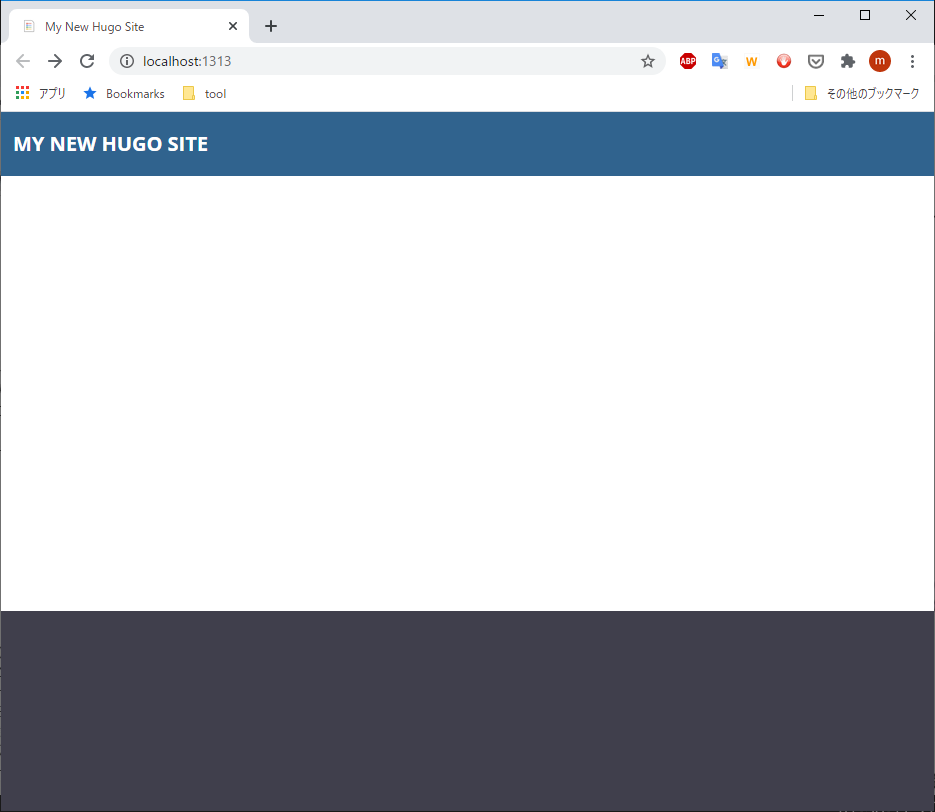
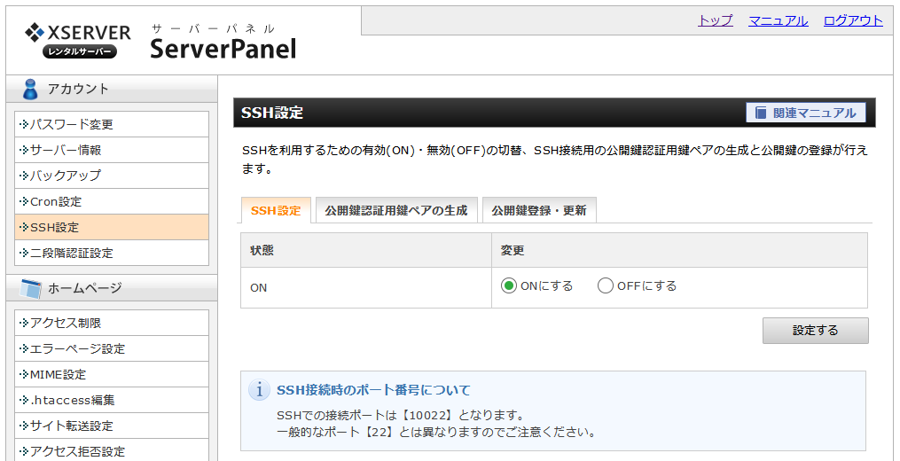
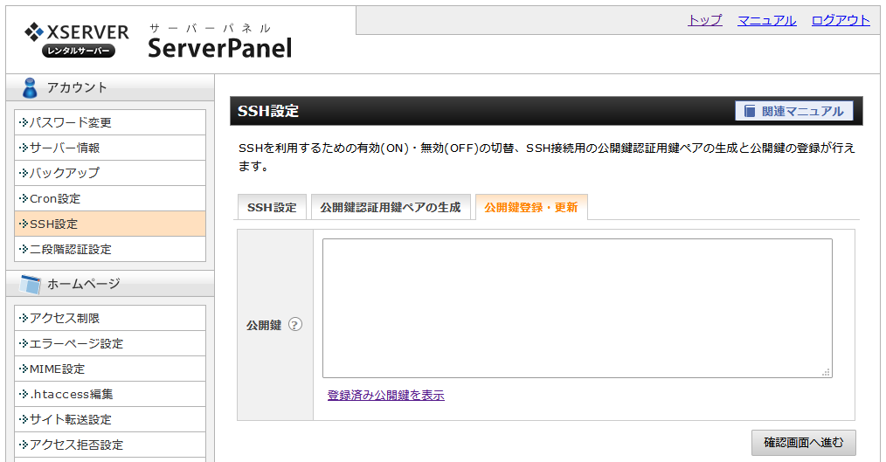
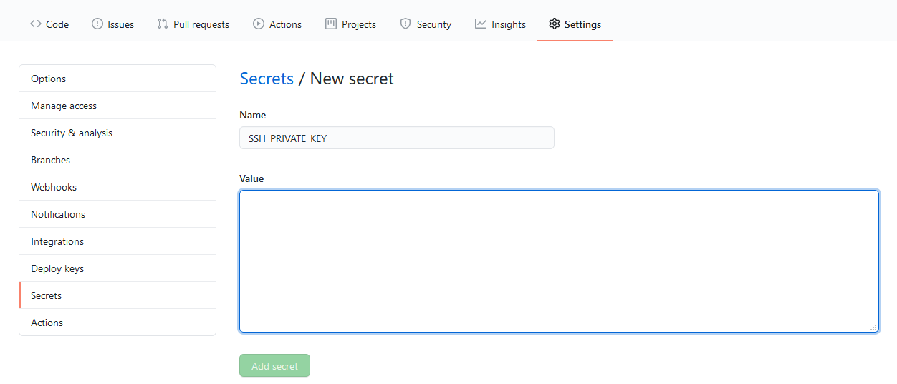
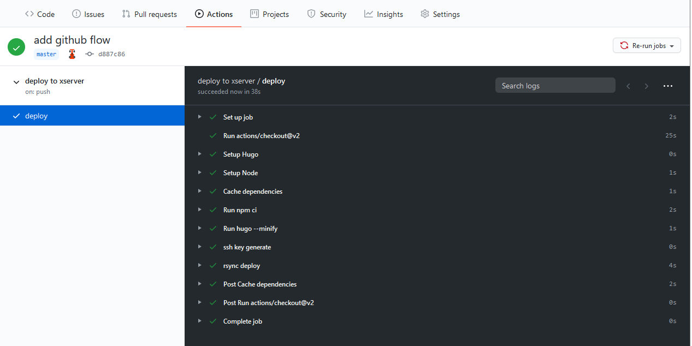

## 利点

大きな利点は以下のとおりです。

- 超高速に閲覧可能なサイトを構築できる
- 編集してGitHubにpushするだけで公開できる

細かい利点は以下のとおりです。

- markdownでページを記述できる
- ページ一覧や目次を勝手に作ってくれる
- 編集結果をローカルですぐに確認できる
- 編集履歴をGitHubで管理できる

## 前提

Windows 10でscoopとgitがインストールされている環境が前提です。
ただ，MacOSやLinuxでもscoopのところをhomebrewやaptなどで読み替えれば，同じような感じでできるかと思います。

## Hugo

静的サイトジェネレータであるHugoのセットアップをします。
テーマはこのサイトでも使っているDocsyを使用します。

### インストール

以下のコマンドでインストールします。

```bash
scoop install hugo-extended
```

Docsyテーマを使う場合 nodejs のインストールも必要です。
以下のコマンドでインストールできます。

```bash
scoop install nodejs
```

### サイトの新規作成

以下のコマンドを実行してサイトを新規作成します。
`myproject` ディレクトリが作られます。

```bash
hugo new site myproject
```

### Docsyテーマのセットアップ

以下のコマンドでサイトのテーマをDocsyテーマに設定します。

```bash
cd myproject
git init
git submodule add https://github.com/google/docsy.git themes/docsy
echo 'theme = "docsy"' >> config.toml
git submodule update --init --recursive
```

以下のコマンドも実行しておきます。
`npm init` 実行時にいろいろと質問されますが適当でかまいません。

```bash
npm init
npm install -D --save autoprefixer
npm install -D --save postcss-cli
```

以下のコマンドでローカルでサイトをプレビューできます。

```bash
hugo server
```

ブラウザ [http://localhost:1313](http://localhost:1313) にアクセスすると以下のページが表示されます。




## ホスティングサーバー

サイトをホスティングするサーバの設定をします。

### sshの設定

GitHubからファイルを受け取れるようにsshの設定をします。
ホスティングサーバ側の設定としては公開鍵を登録してsshで接続できるようにします。

以下はXSERVERでの手順です。

#### 鍵の生成

以下のコマンドで公開鍵を作成します。
今のところOPENSSH形式だと問題が起こりがちなので，古いPEM形式で生成しています。

```bash
ssh-keygen -t rsa -b 4096 -m pem
```

ファイル名はなんでも構いません。ここでは `xserver` と入力したものとします。
パスフレーズを聞かれますが，何も入力せずにEnterキーを押してください。

コマンドが終了すると `xserver` と `xserver.pub` のふたつのファイルが作成されます。
`xserver` は秘密鍵，`xserver.pub` 公開鍵と呼びます。

#### XSERVERに公開鍵を登録

まずSSHを有効にします。
サーバーパネルにSSH設定というページがあるのでそこで有効にしてください。



SSHを有効にしたら公開鍵を登録します。
"公開鍵登録・更新"タブを選択して `xserver.pub` ファイルの中身をコピーアンドペーストします。





#### SSH接続確認

以下のコマンドでsshで接続できるか確認します。
`~/.ssh/xserver` のところは作成した秘密鍵ファイル，`karkn` のところは自分のアカウント，`sv10000.xserver.jp` のところは接続するホスト名に読み替えてください。

```bash
ssh -i ~/.ssh/xserver -p10022 karkn@sv10000.xserver.jp
```

## GitHub

### リポジトリの作成

サイトのソースコードを格納するためのリポジトリを作成します。
詳細な手順は割愛します。
ここでは `myproject` というリポジトリを作成したものとします。

### Secretsの設定

リポジトリの `Settings` タブの `Secrets` ページでSecretを追加します。
`Name` は `SSH_PRIVATE_KEY`，`Value` には `xserver` ファイルの中身をコピーアンドペーストして貼り付けます。



### GitHub Actions ワークフローの設定

GitHub Actionsを使って，masterブランチにpushするたびに自動的にサイトをビルドして，ホスティングサーバにアップロードするようなワークフローを設定します。
`myproject` ディレクトリの下に `.github/workflows/deploy.yml` というファイルを作成して以下の内容を記述します。
最後の `rsync` の接続情報などは適宜読み替えてください。

```yaml
name: deploy to xserver

on:
  push:
    branches:
      - master

jobs:
  deploy:
    runs-on: ubuntu-18.04
    steps:
      - uses: actions/checkout@v2
        with:
          submodules: recursive  # Fetch the Docsy theme
          fetch-depth: 0         # Fetch all history for .GitInfo and .Lastmod

      - name: Setup Hugo
        uses: peaceiris/actions-hugo@v2
        with:
          hugo-version: '0.74.2'
          extended: true

      - name: Setup Node
        uses: actions/setup-node@v1
        with:
          node-version: '12.x'

      - name: Cache dependencies
        uses: actions/cache@v1
        with:
          path: ~/.npm
          key: ${{ runner.os }}-node-${{ hashFiles('**/package-lock.json') }}
          restore-keys: |
            ${{ runner.os }}-node-

      - run: npm ci

      - run: hugo --minify
        env:
          HUGO_ENV: production

      - name: ssh key generate
        run: echo "$SSH_PRIVATE_KEY" > key && chmod 600 key
        env:
          SSH_PRIVATE_KEY: ${{ secrets.SSH_PRIVATE_KEY }}
      - name: rsync deploy
        run: |
          rsync -auzrv \
          -e "ssh -i key -o UserKnownHostsFile=/dev/null -o StrictHostKeyChecking=no -p 10022" \
          --delete \
          ./public/* karkn@sv00000.xserver.jp:/home/karkn/karkn.net/public_html/ \
          --exclude blog/

```

GitHub ActionsでHugoを使えるようにするために [GitHub Actions for Hugo](https://github.com/peaceiris/actions-hugo) を使っています。

### リモートリポジトリの設定

ローカルの `myproject` をリモートリポジトリに紐づけます。
以下のコマンドを実行してください。
アカウントやリポジトリ名は適宜読み替えてください。

```bash
git remote add origin https://github.com/karkn/myproject.git
```

### GitHubにpush

以下のコマンドを実行してpushします。

```bash
git add .
git commit -m "initial commit"
git push
```

GitHubでActionsタブで実行結果を見られます。



### 結果確認

GitHub Actionsのワークフローが完了すると，ホスティングサーバでサイトが見られるようになっています。
ブラウザでアクセスして確認してみてください。

## サイトの修正

以降は簡単な手順でサイトの修正ができます。

### ローカルで編集と確認

`hugo server` コマンドでローカルサーバーを起動して [http://localhost:1313](http://localhost:1313) にアクセスして表示を確認しながらサイトを修正します。
起動したままでも自動的にブラウザの表示に反映されます。
ただしページの追加や削除はうまく認識されないことがあり，`Ctrl+C` でいったん終了してから起動しなおすと認識されます。

### GitHubにpush

修正が終わったら以下のコマンドでGitHubリポジトリに修正をpushします。

```bash
git add .
git commit -m "add foobar"
git push
```

### 修正の確認

しばらくすると自動的にホスティングサーバの内容が更新されます。

以上
