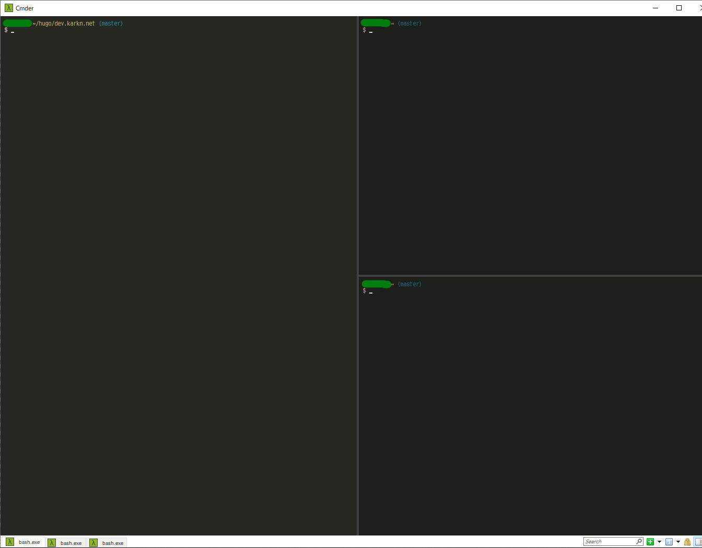

## Cmder

CmderはWindows用コンソールエミュレータです。
コンソールを複数のタブで開いたり，分割表示できます。



インストールするには以下のコマンドを実行します。

```
scoop install cmder
```

## Git for Windows

Git for WindowsはWindows用Gitアプリケーションです。
コマンドラインで実行できる `git` コマンドや，
`bash`，`sed`，`curl`といった便利なコマンドラインアプリケーションがたくさん含まれています。

インストールするには以下のコマンドを実行します。

```
scoop install git
```

## k9s

CUIベースのk8sクラスタ管理ツールです。
k8sを使っている人におすすめです。
PODの一覧を表示や，PODに対するDescribe表示，ログ表示，Shellの実行が簡単にできます。


インストールするには以下のコマンドを実行します。

```
scoop install k9s
```

## hugo-extended

Hugoは静的サイトジェネレータです。
[Hugo]() にも説明がありますのでご参照ください。

インストールするには以下のコマンドを実行します。

```
scoop install hugo-extended
```

## HeidiSQL

HeidiSQLはデータベース管理ツールです。
RDBMSを使っている人におすすめです。

MySQL Workbench 8をインストールしてしまうと，MySQL 5.7サーバに接続できなくなってしまったのでHeidiSQLを利用しています。
HeidiSQLはMySQL 5.7でも8でも問題なく接続できます。


インストールするには以下のコマンドを実行します。

```
scoop bucket add extras # 以前に実行済みであれば不要
scoop install heidisql
```

## AdoptOpenJDK 14 with Oracle HotSpot JVM

AdoptOpenJDKは無償利用できるJDKです。
Javaで開発をしている人におすすめです。

インストールするには以下のコマンドを実行します。

```
scoop bucket add java # 以前に実行済みであれば不要
scoop install adopt14-hotspot
```
